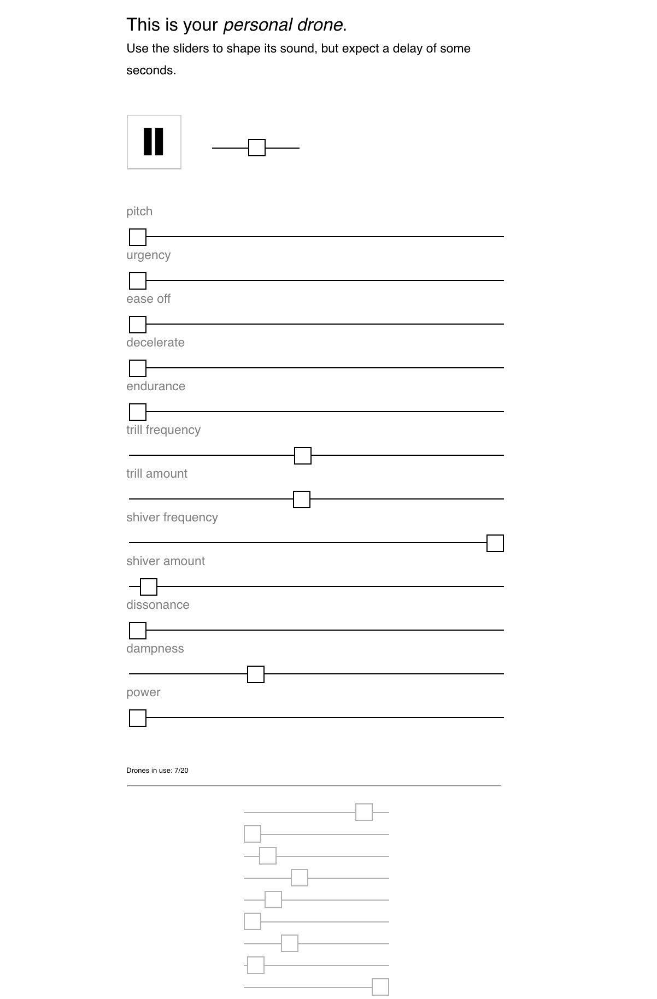

# PdJam
*Distributed online synthesizer*

## Prerequisites

The pure data patch expects the specified icecast server to be running. 
The pdjam server expects a running pure data patch exposing port 5001 for netreceive.  
Run pure data either locally or use the provided docker image at `./pd`

## Run with docker-compose

Define the settings as environment variables or adapt them in the `docker-compose.yml` config directly.
    
    # build docker images
    $ docker-compose build
    
    # run containerized icecast, pure data and pdjam server 
    $ docker-compose up -d

- pdJam server: http://localhost:5000
- Puredata: tcp://localhost:5001
- Icecast audio streaming server: http://localhost:8000

## Development

- Run pure data patch

- Run pdjam server with npm 

    $ cd server
    
    # Install project dependencies (only initially):
    $ npm install
    
    # Start server:
    $ npm start
    
- Run react dev server

    $ cd server/frontend
    
    $ npm install
    
    $ npm start

## Docs

- FUDI - PureData communication protocol: https://en.wikipedia.org/wiki/FUDI